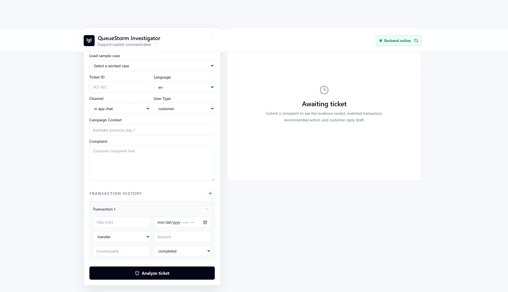

##HomePage



# QueueStorm Investigator

QueueStorm Investigator is an Express.js REST API that acts as an AI-powered support copilot for a digital finance platform. It receives complaint tickets and transaction history, investigates the evidence, and returns a structured JSON response for support agents.

## Setup

```bash
npm install
cp .env.example .env
```

Set `GEMINI_API_KEY` in `.env`. `GEMINI_MODEL` defaults to `gemini-2.0-flash`.

## Run

```bash
npm start
```

The default port is `8000`. Set `PORT` in `.env` to override it.

## Endpoints

### GET /health

Returns:

```json
{"status":"ok"}
```

### POST /analyze-ticket

Accepts a complaint ticket with optional transaction history and returns a structured investigation result.

Example:

```bash
curl -X POST http://localhost:8000/analyze-ticket \
  -H "Content-Type: application/json" \
  -d '{"ticket_id":"TKT-001","complaint":"I sent 5000 taka to a wrong number around 2pm today.","language":"en","channel":"in_app_chat","user_type":"customer","transaction_history":[{"transaction_id":"TXN-9101","timestamp":"2026-04-14T14:08:22Z","type":"transfer","amount":5000,"counterparty":"+8801719876543","status":"completed"}]}'
```

## AI/Model Usage

The service uses Gemini through the Gemini API. The system prompt handles classification, evidence reasoning, routing, and safety guardrails. `responseMimeType: "application/json"` requests clean JSON output.

## Safety Logic

The system prompt explicitly prohibits PIN/OTP requests, unauthorized refund promises, third-party redirects, and prompt injection. Embedded instructions in complaints are ignored. Safe language like "any eligible amount will be returned through official channels" is enforced.

The API also validates the returned JSON shape, constrains enum fields to the required values, and falls back to a safe manual-review response if the AI call fails or returns invalid JSON.

## Known Limitations

The service relies on Gemini API availability. It falls back to a local evidence-based investigation on API failure. Final operational decisions still require the platform's internal policies and support workflows.

## MODELS

`gemini-2.0-flash` is the default model because it is fast, supports JSON responses, and is suitable for the hackathon demo workflow. Override with `GEMINI_MODEL` if needed.
